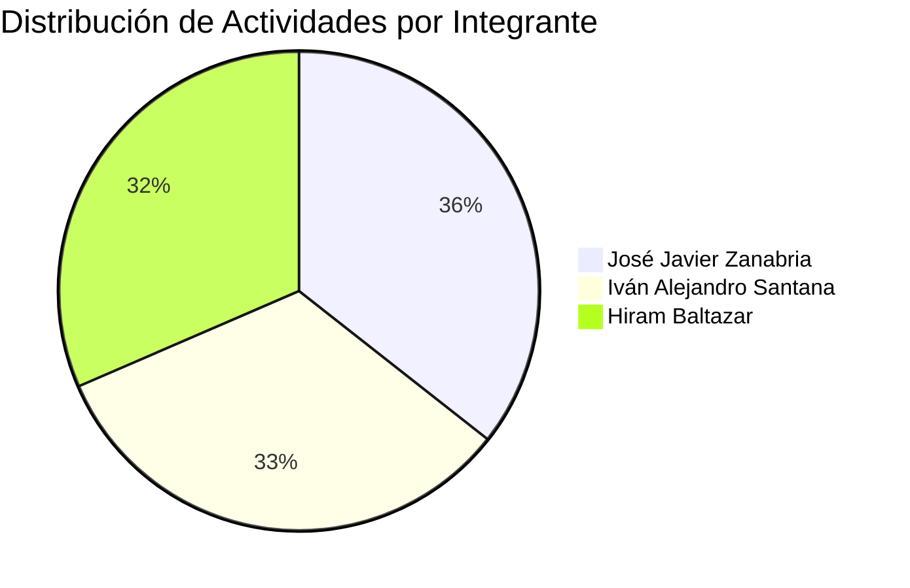
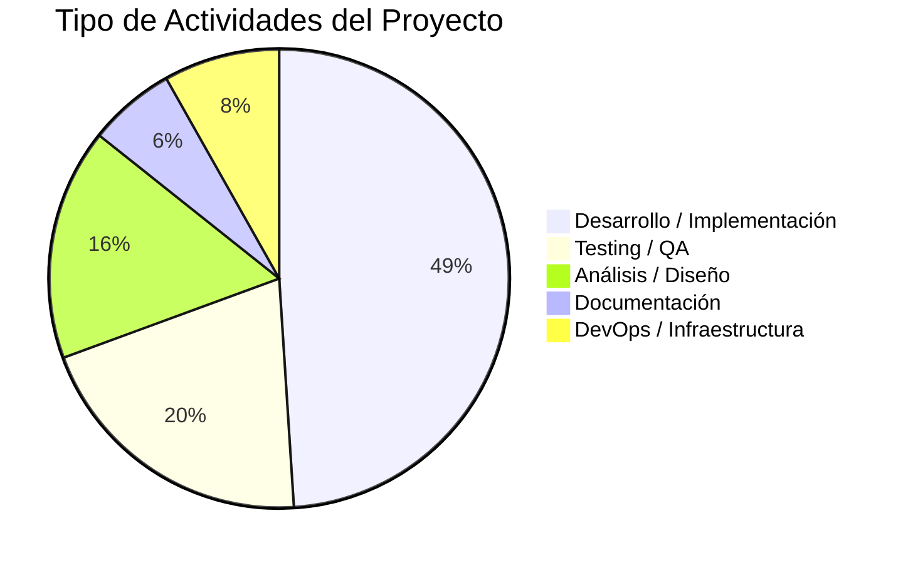
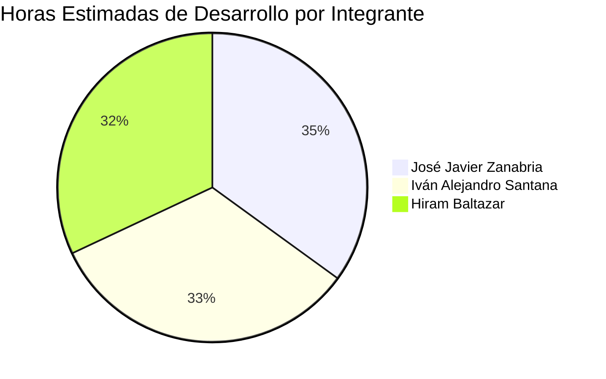
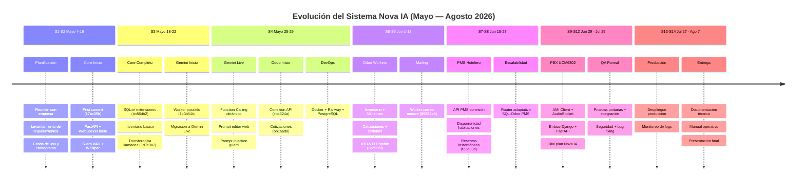
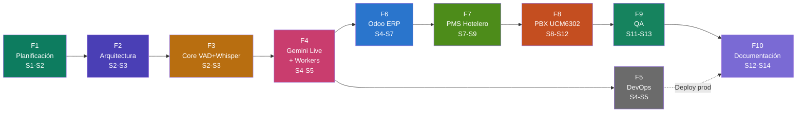

# Nova IA — Planeación de Desarrollo de Software

> **Agente de Voz Inteligente con Integración Empresarial**
> Período: 4 de mayo — 7 de agosto de 2026 · 14 semanas · 3 integrantes

---

## Información General del Proyecto

| Campo | Detalle |
|:------|:--------|
| **Nombre del proyecto** | Nova IA |
| **Descripción** | Sistema de agente de voz inteligente basado en IA con integración a ERP (Odoo), PMS Hotelero y PBX Grandstream UCM6302 |
| **Período total** | Lunes 4 de mayo — Viernes 7 de agosto de 2026 |
| **Duración** | 14 semanas (70 días hábiles) |
| **Modalidad** | Semanas alternas: presencial (empresa) / remota (desarrollo) |
| **Metodología** | Iterativa-incremental con sprints semanales |
| **Repositorio** | `jz8344/NovaIA` |
| **Stack principal** | Python · FastAPI · Django · Gemini Live API · Gemini Flash · PostgreSQL · HTML/CSS/JS |
| **Infraestructura** | Railway (PaaS) · Docker · PBX Grandstream UCM6302 |
| **Integraciones** | Odoo ERP (JSON-RPC2) · PMS Hotelero (API REST) · PBX UCM6302 (AMI/AudioSocket) |

---

## Equipo de Desarrollo

> [!NOTE]
> El equipo está compuesto por 3 desarrolladores con roles especializados pero colaborativos. Cada miembro participa en testing y análisis transversal.

### José Javier Zanabria — *Desarrollador Core · Arquitectura de Sistema*

| Área | Responsabilidades |
|:-----|:------------------|
| **Backend** | FastAPI (voz + workers), Django (admin web), WebSocket streaming |
| **Frontend** | Diseño e implementación de interfaz HTML/CSS/JS |
| **Arquitectura** | Diseño de microservicios, modelo de datos, APIs de integración |
| **Integraciones** | Conexión Odoo (JSON-RPC2), PMS (API REST), PBX (AMI/AudioSocket) |
| **DevOps** | Docker, Railway, PostgreSQL, variables de entorno |
| **IA Core** | Worker Gemini Flash, Function Calling dinámico, prompt loader |

### Iván Alejandro Santana — *Desarrollador IA · QA Correctivo*

| Área | Responsabilidades |
|:-----|:------------------|
| **IA** | Integración Silero VAD + Whisper, personalización agente IA |
| **QA Correctivo** | Corrección de errores post-testing, bug fixing iterativo |
| **AI Testing** | Validación de modelos de voz, pruebas de latencia |
| **Testing** | Pruebas unitarias, testing consultas Odoo/PMS en voz |

### Hiram Baltazar — *Desarrollador · QA Tester & Análisis*

| Área | Responsabilidades |
|:-----|:------------------|
| **QA Testing** | Testing de interfaz, latencia, funcionalidad multi-worker |
| **Bases de datos** | Diseño BD (SQLite → PostgreSQL), configuración Odoo BD |
| **Análisis** | Análisis funcional, propuestas de mejora, escalabilidad |
| **Documentación** | Memoria técnica, manual operativo, guías de configuración |

---

## Distribución de Tareas por Integrante

### Desglose por Fase y Responsable

| Fase | Zanabria | Santana | Hiram | Total Act. |
|:-----|:--------:|:-------:|:-----:|:----------:|
| F1 — Planificación | 3 | 3 | 4 | 5 |
| F2 — Arquitectura | 2 | 2 | 3 | 4 |
| F3 — Core VAD+Whisper | 3 | 3 | 3 | 7 |
| F4 — Gemini Live+Workers | 5 | 5 | 4 | 10 |
| F5 — DevOps | 3 | 2 | 2 | 4 |
| F6 — Odoo ERP | 4 | 4 | 4 | 9 |
| F7 — PMS Hotelero | 3 | 3 | 3 | 7 |
| F8 — PBX Grandstream | 4 | 3 | 3 | 6 |
| F9 — Pruebas QA | 2 | 3 | 2 | 4 |
| F10 — Documentación | 2 | 1 | 2 | 3 |
| **Total participaciones** | **31** | **29** | **30** | **47** |

> [!IMPORTANT]
> Los totales por columna suman más que las 47 actividades porque varias tareas son compartidas entre 2 o 3 integrantes.

### Distribución por Tipo de Actividad

---

## Calendario Semanal

| Sem. | Período | Modalidad | Fase(s) Activa(s) |
|:----:|:--------|:---------:|:-------------------|
| **S1** | 4 – 8 mayo | 🟢 **Presencial** | F1 Planificación |
| **S2** | 11 – 16 mayo | 🟣 Remota | F1 Planificación · F2 Arquitectura · F3 Core inicio |
| **S3** | 18 – 22 mayo | 🟢 **Presencial** | F2 Arquitectura · F3 Core completo |
| **S4** | 25 – 29 mayo | 🟣 Remota | F4 Gemini Live · F5 DevOps · F6 Odoo inicio |
| **S5** | 1 – 5 junio | 🟢 **Presencial** | F4 Gemini · F5 DevOps · F6 Odoo |
| **S6** | 8 – 13 junio | 🟣 Remota | F6 Odoo (cotizaciones, workers) |
| **S7** | 15 – 20 junio | 🟢 **Presencial** | F6 Odoo (mailing) · F7 PMS inicio |
| **S8** | 22 – 27 junio | 🟣 Remota | F7 PMS · F8 PBX análisis |
| **S9** | 29 jun – 4 jul | 🟢 **Presencial** | F7 PMS optim. · F8 PBX desarrollo |
| **S10** | 6 – 11 julio | 🟣 Remota | F8 PBX (AMI, AudioSocket, Dial plan) |
| **S11** | 13 – 18 julio | 🟢 **Presencial** | F8 PBX E2E · F9 QA unitarias + integración |
| **S12** | 20 – 25 julio | 🟣 Remota | F9 QA seguridad + bug fix · F10 Doc inicio |
| **S13** | 27 jul – 1 ago | 🟢 **Presencial** | F5 Producción · F9 QA final · F10 Documentación |
| **S14** | 3 – 7 agosto | 🟣 Remota | F10 Entrega final |

---

## Diagrama de Gantt — Fase 1: Planificación y Análisis

> 🟢 **Semanas S1 – S2** · Color: Verde oscuro

| # | Actividad | Responsable(s) | S1 | S2 | S3 | S4 | S5 | S6 | S7 | S8 | S9 | S10 | S11 | S12 | S13 | S14 |
|:-:|:----------|:----------------|:--:|:--:|:--:|:--:|:--:|:--:|:--:|:--:|:--:|:---:|:---:|:---:|:---:|:---:|
| 1.1 | Reunión inicial con empresa / Introducción | **Todos** | ██ | · | · | · | · | · | · | · | · | · | · | · | · | · |
| 1.2 | Levantamiento de requerimientos del sistema | **Zanabria** · Hiram | ██ | ██ | · | · | · | · | · | · | · | · | · | · | · | · |
| 1.3 | Especificación de req. funcionales y no funcionales | **Hiram** · Zanabria | ██ | ██ | · | · | · | · | · | · | · | · | · | · | · | · |
| 1.4 | Diagrama de casos de uso del sistema | **Hiram** · Zanabria | ██ | ██ | · | · | · | · | · | · | · | · | · | · | · | · |
| 1.5 | Plan de proyecto, cronograma y asignación de roles | **Zanabria** · Santana | ██ | · | · | · | · | · | · | · | · | · | · | · | · | · |

---

## Diagrama de Gantt — Fase 2: Arquitectura y Diseño del Sistema

> 🟪 **Semanas S2 – S3** · Color: Morado

| # | Actividad | Responsable(s) | S1 | S2 | S3 | S4 | S5 | S6 | S7 | S8 | S9 | S10 | S11 | S12 | S13 | S14 |
|:-:|:----------|:----------------|:--:|:--:|:--:|:--:|:--:|:--:|:--:|:--:|:--:|:---:|:---:|:---:|:---:|:---:|
| 2.1 | Modelo de arquitectura del sistema (microservicios) | **Zanabria** · Santana | · | ██ | · | · | · | · | · | · | · | · | · | · | · | · |
| 2.2 | Diseño de modelo de datos / BD (SQLite inicial) | **Hiram** · Santana | · | ██ | · | · | · | · | · | · | · | · | · | · | · | · |
| 2.3 | Definición de APIs, contratos y endpoints | **Zanabria** · Santana | · | ██ | ██ | · | · | · | · | · | · | · | · | · | · | · |
| 2.4 | Configuración del entorno de desarrollo | **Todos** | · | ██ | · | · | · | · | · | · | · | · | · | · | · | · |

---

## Diagrama de Gantt — Fase 3: Core (Silero VAD + Whisper + FastAPI)

> 🟧 **Semanas S2 – S3** · Color: Ámbar
> Commits de referencia: `17ac35b` → `1d7c3a7` (12–18 mayo)

| # | Actividad | Responsable(s) | S1 | S2 | S3 | S4 | S5 | S6 | S7 | S8 | S9 | S10 | S11 | S12 | S13 | S14 |
|:-:|:----------|:----------------|:--:|:--:|:--:|:--:|:--:|:--:|:--:|:--:|:--:|:---:|:---:|:---:|:---:|:---:|
| 3.1 | Frontend web HTML (interfaz principal de voz) | **Zanabria** | · | ██ | ██ | · | · | · | · | · | · | · | · | · | · | · |
| 3.2 | Backend FastAPI + WebSocket streaming audio | **Zanabria** · Santana | · | ██ | ██ | · | · | · | · | · | · | · | · | · | · | · |
| 3.3 | Integración Silero VAD (detección actividad de voz) | **Santana** | · | ██ | ██ | · | · | · | · | · | · | · | · | · | · | · |
| 3.4 | Integración Whisper (transcripción speech-to-text) | **Santana** | · | ██ | ██ | · | · | · | · | · | · | · | · | · | · | · |
| 3.5 | BD SQLite: extensiones telefónicas + inventario básico | **Hiram** | · | · | ██ | · | · | · | · | · | · | · | · | · | · | · |
| 3.6 | Transferencia de llamadas básica por extensión | **Zanabria** · Santana | · | · | ██ | · | · | · | · | · | · | · | · | · | · | · |
| 3.7 | Verificación y análisis testing de interfaz (demo) | **Hiram** | · | ░░ | ░░ | · | · | · | · | · | · | · | · | · | · | · |

> [!TIP]
> ░░ = Tarea de testing continuo / paralelo al desarrollo

---

## Diagrama de Gantt — Fase 4: Migración a Gemini Live 2.0 + Workers

> 🩷 **Semanas S4 – S5** · Color: Rosa
> Commits de referencia: `143b54b` → `3e0de75` (20–24 mayo)

| # | Actividad | Responsable(s) | S1 | S2 | S3 | S4 | S5 | S6 | S7 | S8 | S9 | S10 | S11 | S12 | S13 | S14 |
|:-:|:----------|:----------------|:--:|:--:|:--:|:--:|:--:|:--:|:--:|:--:|:--:|:---:|:---:|:---:|:---:|:---:|
| 4.1 | Integración Gemini Live Native 001 (agente de voz) | **Zanabria** · Santana | · | · | · | ██ | · | · | · | · | · | · | · | · | · | · |
| 4.2 | Gemini Flash Worker (orquestador de consultas) | **Zanabria** · Santana | · | · | · | ██ | ██ | · | · | · | · | · | · | · | · | · |
| 4.3 | Personalización del agente IA (prompt engineering) | **Santana** · Hiram | · | · | · | ██ | ██ | · | · | · | · | · | · | · | · | · |
| 4.4 | Testing latencia modelo voz + worker | **Hiram** · Santana | · | · | · | ░░ | ░░ | · | · | · | · | · | · | · | · | · |
| 4.5 | Corrección de errores IA post-testing | **Santana** | · | · | · | · | ██ | · | · | · | · | · | · | · | · | · |
| 4.6 | Sistema Function Calling dinámico (multi-tool) | **Zanabria** · Hiram | · | · | · | ██ | ██ | · | · | · | · | · | · | · | · | · |
| 4.7 | Panel editor de prompts en interfaz web | **Zanabria** · Hiram | · | · | · | ██ | · | · | · | · | · | · | · | · | · | · |
| 4.8 | Configuración dinámica de prompt por tipo de agente | **Zanabria** · Santana | · | · | · | ██ | ██ | · | · | · | · | · | · | · | · | · |
| 4.9 | Análisis de conmutador: permisos, restricciones, protocolos | **Todos** | · | · | · | ██ | ██ | · | · | · | · | · | · | · | · | · |
| 4.10 | Security guard — detección prompt injection | **Santana** · Zanabria | · | · | · | · | ██ | · | · | · | · | · | · | · | · | · |

> [!WARNING]
> En esta fase se cambió la metodología completa del sistema: de Silero VAD + Whisper a Gemini Live Native 001 como modelo de voz, y Gemini Flash como worker auxiliar para consultas paralelas.

---

## Diagrama de Gantt — Fase 5: DevOps y Despliegue Continuo

> ⬛ **Semanas S4 – S5, S13 – S14** · Color: Gris

| # | Actividad | Responsable(s) | S1 | S2 | S3 | S4 | S5 | S6 | S7 | S8 | S9 | S10 | S11 | S12 | S13 | S14 |
|:-:|:----------|:----------------|:--:|:--:|:--:|:--:|:--:|:--:|:--:|:--:|:--:|:---:|:---:|:---:|:---:|:---:|
| 5.1 | Dockerización del sistema (contenedores) | **Zanabria** · Hiram | · | · | · | ██ | · | · | · | · | · | · | · | · | · | · |
| 5.2 | Despliegue Railway (modo dev) + variables entorno | **Zanabria** · Santana | · | · | · | ██ | ██ | · | · | · | · | · | · | · | · | · |
| 5.3 | Migración SQLite → PostgreSQL (Railway) | **Hiram** · Zanabria | · | · | · | ██ | ██ | · | · | · | · | · | · | · | · | · |
| 5.4 | Despliegue producción + monitoreo de logs | **Zanabria** · Santana | · | · | · | · | · | · | · | · | · | · | · | · | ██ | ██ |

---

## Diagrama de Gantt — Fase 6: Integración Odoo ERP

> 🟦 **Semanas S4 – S8** · Color: Azul
> Commits de referencia: `cb4324a` → `80882a8` (28 mayo – 5 junio)

| # | Actividad | Responsable(s) | S1 | S2 | S3 | S4 | S5 | S6 | S7 | S8 | S9 | S10 | S11 | S12 | S13 | S14 |
|:-:|:----------|:----------------|:--:|:--:|:--:|:--:|:--:|:--:|:--:|:--:|:--:|:---:|:---:|:---:|:---:|:---:|
| 6.1 | Investigación API Odoo + conexión JSON-RPC2 | **Zanabria** · Hiram | · | · | · | ██ | ██ | · | · | · | · | · | · | · | · | · |
| 6.2 | Configuración BD Odoo: usuario API + permisos + datos | **Hiram** | · | · | · | · | ██ | ██ | · | · | · | · | · | · | · | · |
| 6.3 | Odoo Worker: consulta inventario / productos / variantes | **Zanabria** · Santana | · | · | · | · | ██ | ██ | · | · | · | · | · | · | · | · |
| 6.4 | Odoo Worker: crear cotizaciones / órdenes de venta | **Zanabria** · Hiram | · | · | · | · | · | ██ | · | · | · | · | · | · | · | · |
| 6.5 | Testing consultas Odoo en modelo de voz | **Santana** | · | · | · | · | ░░ | ░░ | · | · | · | · | · | · | · | · |
| 6.6 | Odoo Worker: mailing masivo publicitario desde voz | **Zanabria** · Hiram | · | · | · | · | · | ██ | ██ | · | · | · | · | · | · | · |
| 6.7 | Testing mailing + verificación de funcionalidad | **Santana** | · | · | · | · | · | · | ░░ | · | · | · | · | · | · | · |
| 6.8 | Análisis de escalabilidad (100 llamadas simultáneas) | **Zanabria** · Hiram | · | · | · | · | · | · | ██ | · | · | · | · | · | · | · |
| 6.9 | Metodología flujo adaptativo (SQL / Odoo / PMS router) | **Zanabria** · Hiram | · | · | · | · | · | · | ██ | ██ | · | · | · | · | · | · |

---

## Diagrama de Gantt — Fase 7: Integración PMS Hotelero

> 💚 **Semanas S7 – S9** · Color: Verde claro
> Commits de referencia: `f23d33d` → `6245512` (16–19 junio)

| # | Actividad | Responsable(s) | S1 | S2 | S3 | S4 | S5 | S6 | S7 | S8 | S9 | S10 | S11 | S12 | S13 | S14 |
|:-:|:----------|:----------------|:--:|:--:|:--:|:--:|:--:|:--:|:--:|:--:|:--:|:---:|:---:|:---:|:---:|:---:|
| 7.1 | Análisis y mapeado API PMS Hotelería | **Zanabria** | · | · | · | · | · | · | ██ | · | · | · | · | · | · | · |
| 7.2 | Conexión API PMS + usuario específico de integración | **Zanabria** · Hiram | · | · | · | · | · | · | ██ | ██ | · | · | · | · | · | · |
| 7.3 | PMS Worker: consulta disponibilidad de habitaciones | **Santana** · Zanabria | · | · | · | · | · | · | ██ | ██ | · | · | · | · | · | · |
| 7.4 | PMS Worker: crear / modificar reservas instantáneas | **Zanabria** · Santana | · | · | · | · | · | · | ██ | ██ | · | · | · | · | · | · |
| 7.5 | Personalización agente voz para funciones hoteleras | **Santana** · Hiram | · | · | · | · | · | · | ██ | ██ | · | · | · | · | · | · |
| 7.6 | Testing y propuestas de mejora en plataforma PMS | **Todos** | · | · | · | · | · | · | · | ░░ | ░░ | · | · | · | · | · |
| 7.7 | Optimización PMS Worker + corrección de latencia | **Zanabria** · Santana | · | · | · | · | · | · | · | ██ | ██ | · | · | · | · | · |

---

## Diagrama de Gantt — Fase 8: Integración PBX Grandstream UCM6302

> 🟥 **Semanas S8 – S12** · Color: Naranja-rojo

| # | Actividad | Responsable(s) | S1 | S2 | S3 | S4 | S5 | S6 | S7 | S8 | S9 | S10 | S11 | S12 | S13 | S14 |
|:-:|:----------|:----------------|:--:|:--:|:--:|:--:|:--:|:--:|:--:|:--:|:--:|:---:|:---:|:---:|:---:|:---:|
| 8.1 | Análisis arquitectura PBX + diagrama de red | **Zanabria** · Santana | · | · | · | · | · | · | · | ██ | · | · | · | · | · | · |
| 8.2 | AMI Client + AudioSocket Server (Asterisk) | **Zanabria** · Santana | · | · | · | · | · | · | · | · | ██ | ██ | · | · | · | · |
| 8.3 | Enlace PBX ↔ Django Admin (extensiones, CDRs) | **Zanabria** · Hiram | · | · | · | · | · | · | · | · | ██ | ██ | · | · | · | · |
| 8.4 | Enlace PBX ↔ FastAPI voz + Gemini Live | **Zanabria** · Santana | · | · | · | · | · | · | · | · | · | ██ | ██ | · | · | · |
| 8.5 | Dial plan UCM6302 → AudioSocket → Nova IA | **Zanabria** · Hiram | · | · | · | · | · | · | · | · | · | ██ | ██ | ██ | · | · |
| 8.6 | Pruebas llamadas reales PBX extremo a extremo | **Todos** | · | · | · | · | · | · | · | · | · | · | ░░ | ░░ | · | · |

---

## Diagrama de Gantt — Fase 9: Pruebas y Aseguramiento de Calidad

> 🌿 **Semanas S5 (parcial), S11 – S13** · Color: Verde menta

| # | Actividad | Responsable(s) | S1 | S2 | S3 | S4 | S5 | S6 | S7 | S8 | S9 | S10 | S11 | S12 | S13 | S14 |
|:-:|:----------|:----------------|:--:|:--:|:--:|:--:|:--:|:--:|:--:|:--:|:--:|:---:|:---:|:---:|:---:|:---:|
| 9.1 | Pruebas unitarias (auth, BD, workers) | **Santana** | · | · | · | · | ░░ | · | · | · | · | · | ██ | ██ | · | · |
| 9.2 | Pruebas de integración multi-worker | **Todos** | · | · | · | · | · | · | · | · | · | · | ██ | ██ | · | · |
| 9.3 | Revisión de seguridad y rotación de secretos | **Zanabria** · Santana | · | · | · | · | · | · | · | · | · | · | · | ██ | ██ | · |
| 9.4 | Bug fixing y correcciones finales | **Santana** · Zanabria | · | · | · | · | · | · | · | · | · | · | · | ██ | ██ | · |

---

## Diagrama de Gantt — Fase 10: Documentación y Entrega Final

> 💜 **Semanas S12 – S14** · Color: Lavanda

| # | Actividad | Responsable(s) | S1 | S2 | S3 | S4 | S5 | S6 | S7 | S8 | S9 | S10 | S11 | S12 | S13 | S14 |
|:-:|:----------|:----------------|:--:|:--:|:--:|:--:|:--:|:--:|:--:|:--:|:--:|:---:|:---:|:---:|:---:|:---:|
| 10.1 | Documentación técnica del sistema (memoria técnica) | **Hiram** · Zanabria | · | · | · | · | · | · | · | · | · | · | · | ██ | ██ | · |
| 10.2 | Manual operativo / guía de configuración | **Hiram** · Zanabria | · | · | · | · | · | · | · | · | · | · | · | · | ██ | ██ |
| 10.3 | Presentación y entrega final al cliente | **Todos** | · | · | · | · | · | · | · | · | · | · | · | · | · | ██ |

### Carga de Trabajo por Integrante

---

## Línea Temporal de Desarrollo — Evolución del Sistema

---

## Diagrama de Fases del Proyecto

---

## Resumen de Métricas del Proyecto

| Métrica | Valor |
|:--------|:------|
| **Total de fases** | 10 |
| **Total de actividades** | 47 |
| **Duración total** | 14 semanas (70 días hábiles) |
| **Semanas presenciales** | 7 (S1, S3, S5, S7, S9, S11, S13) |
| **Semanas remotas** | 7 (S2, S4, S6, S8, S10, S12, S14) |
| **Commits verificados** | 25 (período mayo–junio 2026) |
| **Versiones estables** | V10, V11, V14, V15, V16 |
| **Integraciones externas** | 3 (Odoo ERP, PMS Hotelero, PBX UCM6302) |
| **Modelos IA** | 2 (Gemini Live Native 001 — voz, Gemini Flash — worker) |
| **Bases de datos** | 3 (SQLite dev, PostgreSQL prod, Odoo ERP) |
| **Plataforma de despliegue** | Railway (PaaS) + Docker |
| **Protocolos de integración** | JSON-RPC2, REST API, AMI, AudioSocket, WebSocket |

---

## Trazabilidad — Commits del Repositorio Git

> Verificados directamente con `git log --all --format="%h %ad %an %s" --date=short`

| Hash | Fecha | Sem. | Autor | Descripción | Fase |
|:-----|:------|:----:|:------|:------------|:-----|
| `17ac35b` | 2026-05-12 | S2 | jz8344 | First commit — Estructura inicial | F3 |
| `3600a5e` | 2026-05-15 | S2 | jz8344 | Second Commit — Backend FastAPI base | F3 |
| `25aa632` | 2026-05-15 | S2 | jz8344 | Tercer Commit Estable — VAD + Whisper funcional | F3 |
| `4aab4b8` | 2026-05-15 | S2 | jz8344 | Cuarto commit — Mejoras transcripción | F3 |
| `cb86db2` | 2026-05-18 | S3 | jz8344 | Quinto Commit — SQLite extensiones | F3 |
| `3bff132` | 2026-05-18 | S3 | jz8344 | Sexto Commit — Consulta inventario SQLite | F3 |
| `1d7c3a7` | 2026-05-18 | S3 | jz8344 | Séptimo Commit — Transferencia llamadas | F3 |
| `143b54b` | 2026-05-20 | S3 | jz8344 | Octavo Commit V2 — Búsquedas largas | F4 |
| `b86b3bd` | 2026-05-20 | S3 | jz8344 | Noveno Commit — Worker paralelo | F4 |
| `1c0a6f9` | 2026-05-21 | S3 | jz8344 | Décimo Commit — Config prompts | F4 |
| `1b18eac` | 2026-05-21 | S3 | jz8344 | Onceavo Commit — Migración Gemini | F4 |
| `af8003b` | 2026-05-22 | S3 | jz8344 | Co-authored: Ivan-Santana908 + tkerk | F4 |
| `fcbe180` | 2026-05-22 | S3 | jz8344 | Doceavo commit — Estabilización | F4 |
| `3e0de75` | 2026-05-24 | S4 | jz8344 | Refact Plural Search | F4 |
| `cb4324a` | 2026-05-28 | S4 | jz8344 | Odoo Client test — API Odoo | F6 |
| `bb1a6da` | 2026-05-29 | S4 | jz8344 | Cotizaciones Odoo Create | F6 |
| `0796c39` | 2026-06-02 | S5 | jz8344 | Fix Prompt Loader + Gemini Live | F4/F5 |
| `5f8e35a` | 2026-06-03 | S5 | jz8344 | **V10 ESTABLE** — Cotización + Prompt Loader | F6 |
| `3ac936f` | 2026-06-03 | S5 | jz8344 | **V11 Estable** — Sistema consolidado | F5 |
| `aac343e` | 2026-06-04 | S5 | jz8344 | V11.1 README — Documentación | F10 |
| `80882a8` | 2026-06-05 | S5 | jz8344 | **V12** Mailing Worker Odoo | F6 |
| `c034632` | 2026-06-12 | S6 | jz8344 | **V13** Fixes UI, Prompt Save, Responsive | F4 |
| `f23d33d` | 2026-06-16 | S7 | jz8344 | **V14** PMS Calling — Integración PMS | F7 |
| `c5882cb` | 2026-06-17 | S7 | jz8344 | **V15** API PMS Fixs, Prompt Loader fix | F7 |
| `6245512` | 2026-06-19 | S7 | jz8344 | **V16** System Fixs — Correcciones generales | F7/F9 |

---

